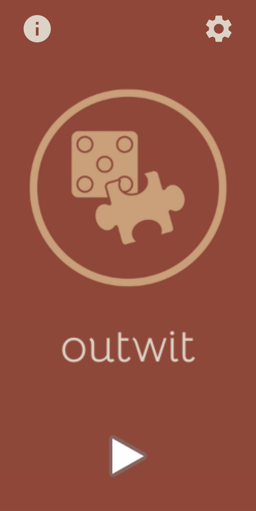
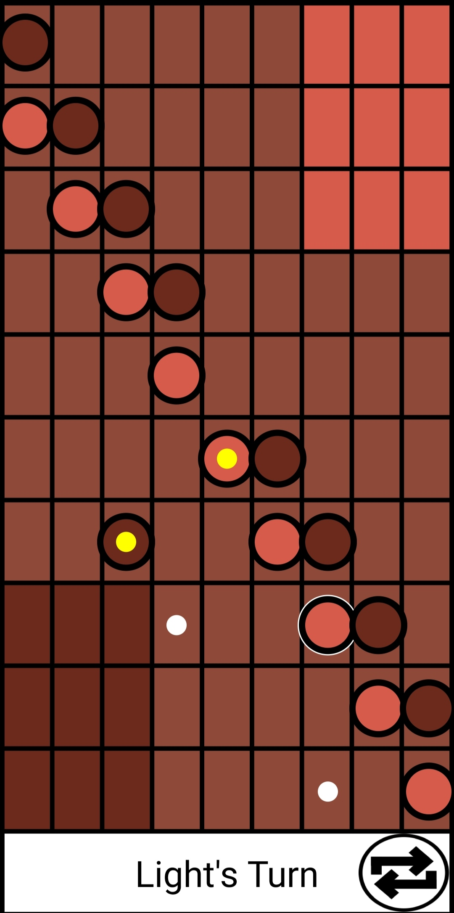
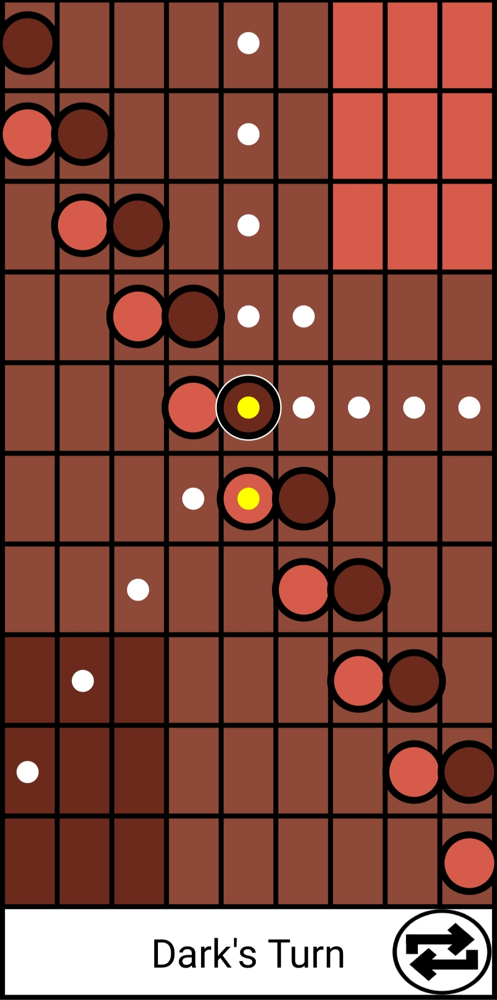
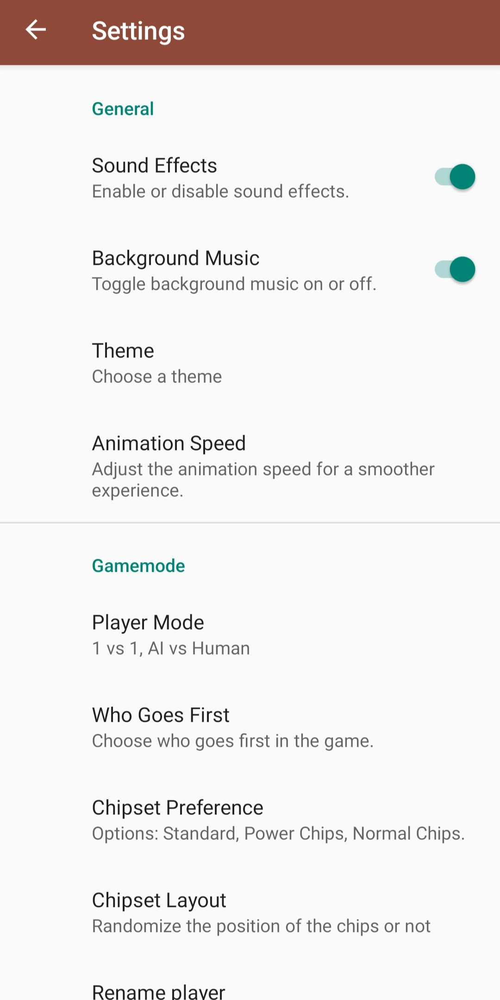

# Outwit

## Introduction
Outwit is a strategic mobile game where players aim to slide all nine of their chips into their own corner of the board. The game stands out for its unique gameplay mechanics, combining strategy and foresight.

## Game Description
In Outwit, each player starts with nine chips placed in the middle of the board. Players take turns moving a chip towards their corner. There are two types of chips: regular and power chips. Regular chips move horizontally or vertically, while power chips can also move diagonally. A chip must slide as far as it can unless it's stopped by an obstacle.

### Objective
Be the first to get all your chips into your corner.

## Visuals

## Installation
1. Clone the repository: `git clone https://github.com/DanielH987/Outwit.git`
2. Navigate to the project directory: `cd outwit`

## How to Play
- Start the game from the main menu by selecting "Play."
- Choose your chip and decide its direction.
- Remember, a chip moves until it is stopped.

## Technology Stack
- Language: Java
- IDE: Android Studio
- Build system: Gradle

## Features
- Unique strategic gameplay
- Two types of chips with different movement abilities
- Intuitive user interface

## Contributing
Contributions are what make the open-source community such an amazing place to learn, inspire, and create. Any contributions you make are **greatly appreciated**.

1. Fork the Project
2. Create your Feature Branch (`git checkout -b feature/AmazingFeature`)
3. Commit your Changes (`git commit -m 'Add some AmazingFeature'`)
4. Push to the Branch (`git push origin feature/AmazingFeature`)
5. Open a Pull Request

## Contact
Your Name - [your-email@example.com](mailto:your-email@example.com)

## Acknowledgments
- [Contributor 1]
- [Contributor 2]
- [Third-party assets or libraries used]

## Changelog
- v1.0.0 Initial release

## FAQs
**Q: Can I play Outwit offline?**
A: Yes, Outwit can be played without an internet connection.
